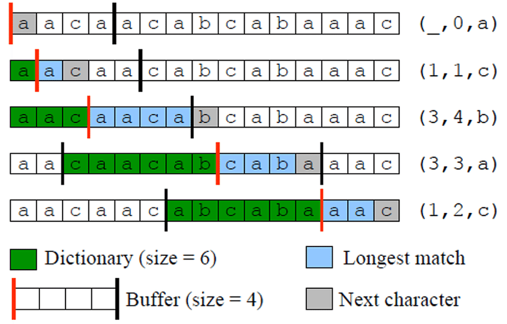
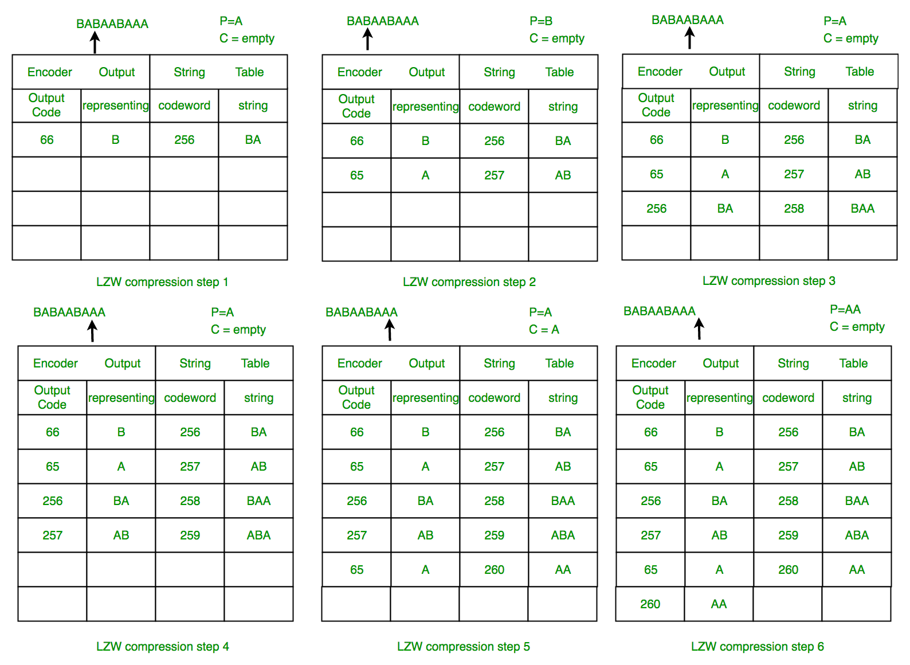
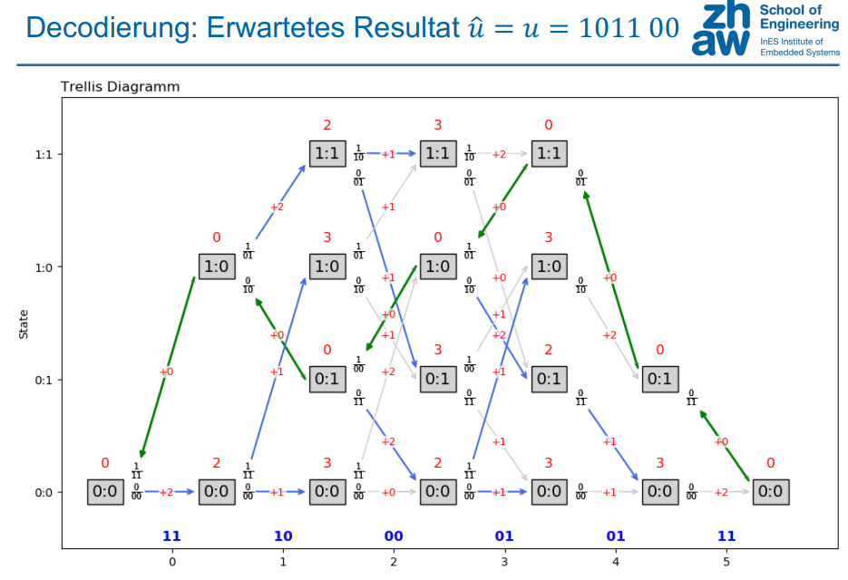
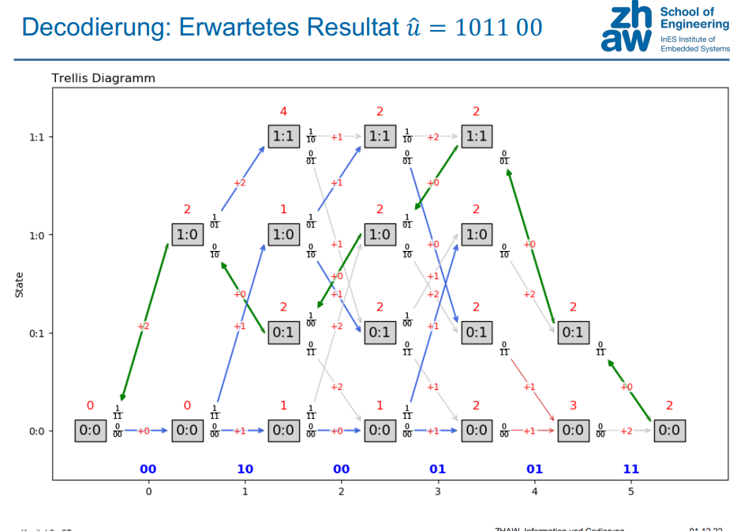

---
title:  'INCO Zusammenfassung'
author:
- Manuel Strenge
keywords: [INCO, pain]
...

\newpage

# Zahlensysteme

## Binär & Hexadezimal

### Binär

Ein Zahlensystem mit Basis 2 heisst 2-er System,
Binärsystem oder Dualsystem

**Grössen**

  Name                  Speicher                          
-------                 ------                           
Bit (binary digit)      Speicher 0/1 (True/False)       
Byte (Octet)            8 Bit oder 2 Nibble a 4 Bit     

### Hexadezimal

Das Zahlensystem mit der Basis 16 heisst 16-er System
oder Hexadezimalsystem.

* Es umfasst 16 Werte ( $0..15_{d}$)
* Da unser bekanntes Zahlensystem nur zehn Ziffern umfasst, behilft
man sich für die Werte 10 bis 15 mit Buchstaben:
0, 1, 2, 3, 4, 5, 6, 7, 8, 9, A, B, C, D, E, F
* Wir bezeichnen die Hexadezimalzahlen mit einem Index h.
Beispiel: $AF3C_{h}$ 

Beispiel:

### Tabelle
10er System                 2er System      16er System                        
-----------                 ----------      -----------
0                           0000            0
1                           0001            1
2                           0010            2
3                           0011            3
4                           0100            4
5                           0101            5
6                           0110            6
7                           0111            7
8                           1000            8
9                           1001            9
10                          1010            A
11                          1011            B
12                          1100            C
13                          1101            D
14                          1110            E
15                          1111            F

### Berechnungen

> Der einfachste weg ist immer zu Dezimal zu konvertieren und darauf wieder zurückzuwandeln in das gewünschte Format.

Folgende Probleme können auftreten:

* Es ist nicht jede beliebig grosse Zahl darstellbar
* Die zahlenmässige Bedeutung eines Bitmusters hängt davon ab, ob man von vorzeichenlosen oder vorzeichenbehafteten Zahlen spricht.
* Bei der Berechnung von Summen oder Produkten kommt es zu Überläufen, wenn das Resultat nicht mehr darstellbar ist
* Bei vorzeichenlosen Zahlen passieren Überläufe zwischen 0 und der grössten darstellbaren Zahl.
* Bei vorzeichenbehafteten Zahlen passieren Überläufe zwischen der grössten positiven und der kleinsten negativen Zahl.
* Bei Überläufen kann ein falsches Resultat entstehen, wenn das betreffende Überlaufsflag (Carry, Overflow) nicht beachtet wird (was der Normalfall ist).

## Negative Zahlen(2-er Komplement) & Endliche Zahlen(Fixe Anzahl Bit und Modulo Rechnung)

Hierbei geht es darum wo der Umschlagspubkt im Format definiert wurde. (Hier 4 Bit's)
Hier ein paar Möglichkeiten:

{ width=50% }
{ width=50% }

# Digitaltechnik

## Kombinatorik
* Einfache Logische Operationen
  - Symbole / Logische Gleichungen / Warheitstabellen

### Einfache logische Operationen

**Inverter:** $Z = !A$
**Buffer:** $Z = A$
{ width=20% }
{ width=20% }

A $$!A$$  
- ------
0 1     
1 0

**AND:** $Z = A \& B$
**OR:** $Z = A \# B$
**NAND:** $Z = !(A \& B)$
**NOR:** $Z = !(A \# B)$
**EXOR:** $Z = A \$ B$

{ width=20% }
{ width=20% }
{ width=20% }
{ width=20% }
{ width=20% }

A B $$A \& B$$  $$A \# B$$  $$!(A \& B)$$   $$!(A \# B)$$   $$A \$ B$$
- - ----------  ----------  -------------   -------------   ----------
0 0 0           0           1               1               0
0 1 0           1           1               0               1
1 0 0           1           1               0               1
1 1 1           1           0               0               0

### Alle Symbole

{ width=50% }

### Vereinfachung

> Ziel ist die Disjunktive Normalform (DNF)
> Die DNF besteht (auf der obersten Ebene) ausschliesslich aus OR-Verknüpfungen von AND-verknüpften Eingangsvariablen, die auch invertiert sein können.

Beispiel:

$$ Z = (A \& B \& C \& D) \# (A \& B \& !C \& !D) \# (C \& !D) $$

**Vorteile**

* Verwendung von möglichst wenigen / einfachen Gattern (HW) oder Instruktionen (SW)
* Erzielung einer möglichst kurzen Durchlaufzeit (bei HW) oder Ausführungszeit (bei SW)
* Das Resultat ist möglicherweise leichter zu verstehen und zu testen

**Nachteile**

* Nachverfolgbarkeit: Die vereinfachte / optimierte Funktion entspricht nicht mehr dem «Pflichtenheft»
* Wartbarkeit: Bei Änderungen muss die Optimierung erneut vorgenommen werden
* Zuverlässigkeit: Die Optimierung ist eine mögliche Fehlerquelle

### Gesetze

{ width=50% }
{ width=50% }

## Sequenzielle Logik

### D-Flip-Flop

Wert am Eingang D wird
gespeichert und an den
Ausgang Q übertragen,
wenn C von 0 auf 1 wechselt. 

{ width=20% }

Hierbei wird bei jedem Takt (*C*) der input von *D* zu *Q* weitergegeben 

{ width=50% }

**Verwendungen**

* Finite State Machine (Speicherzellen stellen den Systemzustand dar)
* Zähler (Neuer Zustand ist vorgegeben durch jetzigen Zustand.)
* Schieberegister (Mehrere in Reihe geschaltete FFs.)
\newpage

# Entropie, Information und Quellcodierungsthemen

Auftrittswahrscheinlichkeit:
$$P(x_{n}) = \frac{1}{N} \Rightarrow N = \frac{1}{P(x_{n})}$$

Informationsgehalt in Bit:
$$I(x_{n}) = \log_{2}\frac{1}{P(x_{n})} $$

Bestimmung von $P(x_{n})$ durch Auszählen:

{ width=70% }

> $k(x_{n})$ sei die absolute Häufigkeit von $x_{n}$  in den $K$ Ereignissen

Die Auftretenswahrscheinlichkeit (oder relative Häufigkeit) ist dann:
$$P(x_{n}) = \frac{k(x_{n})}{K} $$

Berechnung des Mittelwerts $H(X)$ des Informationsgehalt auch **Entropie** genannt.

## Binary Memoryless Source (BMS)

* Eine BMS kennt, wie der Name sagt, nur 2 Symbole
* st $p$ die Auftretenswahrscheinlichkeit des einen Symbols, folgt dass $(1-p)$ jene des anderen Symbols ist.
* Für die binäre Entropie $H_{b}$ gilt:

$$H_{b} = p\cdot \log_{2}\frac{1}{p}+ (1-p) \cdot \log_{2}\frac{1}{1-p}$$

## Redundanz

Entropie: 
$$H(X) = \sum_{n=0}^{N-1}P(x_{n})\cdot I(x_{n})$$

Mittlere Länge der Codiuerung $l_{n} =$ länge der Codes:

$$L = \sum_{n=0}^{N-1}P(x_{n})\cdot l_{n}$$

redundanz (Bit/Symbol):

$$R = L - H $$

# Verlustlose Quellencodierung

## Runlength Encoding

{ width=100% }

## Huffman

* Statistisches Kompressionsverfahren:

> Häufige Symbole erhalten kurze Codes.
>
> Seltene Symbole erhalten lange Codes.

* Symbol-Wahrscheinlichkeiten $P(x_{n})$ müssen bekannt sein

{ width=100% }

## LZ77

> Alle Zeichen werden durch Token von fixer Länge ersetzt:

> Token: (Offset, Länge, Zeichen)

{ width=100% }

> Im Such-Buffer wird die längste Übereinstimmung mit dem Vorschau-Buffer gesucht und als Token ausgegeben.
> Keine Übereinstimmung: Token (0, 0, Zeichen) wird verwendet.

{ width=100% }

## LZW

* Statt einem Sliding Window wird ein Wörterbuch verwendet.
* Der Index nummeriert die Einträge des Wörterbuchs.
* Der String bildet den eigentlichen Eintrag.
* Wörterbuch wird initialisiert mit den möglichen Zeichen resp. Byte-Werten (0..255).
* Token enthält nur den Index des schon bestehenden Eintrags im Wörterbuch, nicht aber das zusätzliche Zeichen. Token: (Index)
* Das neue Zeichen wird erst mit dem nächsten Token übermittelt (Überlappung):

{ width=100% }

{ width=20% }
{ width=80% }

# Verlustbehaftete Quellencodierung:Einfache, kurze Prinzipfragen

## JPEG

{ width=80% }
{ width=20% }

DCT: $F_{vu} = \frac{1}{4} C_{u} C_{v} \sum_{n=0}^{7}\sum_{n=0}^{7}B_{yx}\cos\left(\frac{(2x+1)u\Pi }{16}\right)\cos\left(\frac{(2x+1)v\Pi }{16}\right)$

Inverse DCT: $B_{xy} = \frac{1}{4} \sum_{n=0}^{7}\sum_{n=0}^{7}C_{u} C_{v} F_{uv}\cos\left(\frac{(2x+1)u\Pi }{16}\right)\cos\left(\frac{(2x+1)v\Pi }{16}\right)$

{ width=50% }
{ width=50% }

## Audiocodierung
{ width=20% }
{ width=80% }

# Kanalmodell für BSC und Kanalcodierungstheorem (ohne Entropien im Zusammenhang mit dem Kanalmodell)

Erfolgswahrscheinlichkeit: $P_{0,N} = (1-\varepsilon )^{N}$

Fehlerwahrscheinlichkeit auf $N$ Datenbits: $1 - P_{0,N} =1- (1-\varepsilon )^{N}$

> Die Wahrscheinlichkeit $P_{F,N}$ , dass in einer Sequenz von $N$ Datenbits genau $F$ Bitfehler auftreten, ist:
$$B_{F,N} = \binom{N}{F} \cdot \varepsilon^{F} \cdot (1-\varepsilon)^{N-F}$$

$\binom{N}{F}$ ist der sogenannte Binomialkoeffizient aus der Kombinatorik.

> Für die Wahrscheinlichkeit, dass maximal F Fehler bei einer Übertragung von N Bits auftreten, bilden wir die Summe aller Fälle:

$$P_{\leq F,N} = \sum_{t=0}^{F} \binom{N}{t}\cdot \varepsilon \cdot (1-\varepsilon )^{N-t}$$

> Oft will man die Restfehlerwahrscheinlichkeit wissen, also die Wahrscheinlichkeit, dass mehr als F Fehler bei einer Übertragung von N Bits auftreten:

$$P_{> F,N} = P_{\leq F,N}-1$$

## Eigenschaften von Codes (zB systematisch, linear, zyklisch, perfekt)

### Systematischer (N,K)-Blockcode:

> Die K Informationsbits erscheinen im Codewort am einem Stück

{ width=100% }

> Systematische Blockcodes lassen sich besonders einfach decodieren: Es müssen lediglich die Fehlerschutzbits entfernt werden.

### Binärer Blockcodes: Linearität

> Bei einem linearen(N,K)-Blockcode ist die bitweise Exor-Verknüpfung
> von 2 beliebigen Codewörtern (inklusive des selben) wieder ein gültiges
> Codewort:

{ width=100% }

> Jeder lineare Code muss zwingend das Null-Codewort (000) enthalten
> Anmerkung: Mathematisch nennt man die bitweise Exor-Verknüpfung eine
> bitweise Modulo-2-Summe (1-bit-Summe ohne Übertrag).

Bei linearen (N,K)-Blockcodes ist $d_{min}$ die minimale HammingDistanz der gültigen Codes zum Null-Codewort,

### Linearer, zyklischer (N,K)-Blockcode

> Die zyklische Verschiebung eines Codeworts gibt wieder ein Codewort:

{ width=100% }

> Ein linearer, zyklischer Blockcode wird später eingehend besprochen (siehe Abschnitt CRC).

### Perfekter Code 

> Ein Code heisst ein «perfekter Code», wenn jedes empfangene Wort w
> genau ein Codewort c hat, zu dem es einen geringsten HammingAbstand hat und zu dem es eindeutig zugeordnet werden kann

## Hammingdistanz

* Hamming-Distanz ist die Anzahl der wechselnden Bits von einem gültigen Code zum nächsten gültigen Code

{ width=100% }

Das Hamming-Gewicht $w_{H}(c_{j})$

* gibt an, wieviele Einsen das Codewort $c_{j}$ enthält.
* darf nicht mit Hamming-Distanz verwechselt werden!

## Coderate berechnen

Coderate $R$ : $R = \frac{K}{N}$

## Kanalkapazität berechnen

C: Kanalkapazität in bit/bit (Nutzbare Bits pro Kanalbenutzung)
$$H_{b}= \varepsilon \cdot \log_{2}\frac{1}{\varepsilon }+ (1-\varepsilon )\cdot \log_{2}\frac{1}{1-\varepsilon}$$
$$C_{BSC}(\varepsilon ) = 1 - H_{b}(\varepsilon )$$

## Kanalcodierungstheorem

Das Kanalcodierungstheorem beschreibt, unter welcher Bedingung sich
die Wahrscheinlichkeit von Fehlern beliebig reduzieren lässt.

> Möchte man die Restfehlerwahrscheinlichkeit
> eines Fehlerschutzcodes beliebig klein machen,
> so muss $R < C$ sein.

# Kanalcodierung

## CRC (einfache Beispiele)

> Generator-Polynome (Divisor) werden in der folgenden Form
> beschrieben: $X^{4} + X+1$ , was $X^{4} * 1 + X^{3} * 0 + X^{2} * 0 + X^{1} *1 + X^{0} *1$
> bedeutet und 10011( entspricht.

Die Hamming-Distanz ist abhängig von der Wahl des Generator
Polynoms und der Länge der Daten. 

{ width=50% }
{ width=50% }

> Spezialfall: Wenn der Fehlervektor durch $g$ teilbar ist, wird auch das
> Bitmuster $h$ ohne Rest durch $g$ teilbar sein à der Fehler ist nicht erkennbar

## Blockcodes mit Generator-und Paritycheckmatrix, Syndrom 

### Encoding

> Durch Multiplikation des
> Datenvektors $u$ mit der
> Generatormatrix $G$ wird
> das Codewort $c_{10}$ erzeugt.  

$$\underset{Daten-u}{
\begin{bmatrix}
0 & 1 & 0 & 1
\end{bmatrix}
}
\cdot
\underset{Generatormatrix-G}{
\begin{bmatrix}
{\color{orange} 1} &{\color{orange} 1}  &{\color{orange} 0}  &{\color{green} 1}  &{\color{green} 0}  &{\color{green} 0}  &{\color{green} 0} \\ 
{\color{orange} 0} &{\color{orange} 1}  &{\color{orange} 1}  &{\color{green} 0}  &{\color{green} 1}  &{\color{green} 0}  &{\color{green} 0} \\ 
{\color{orange} 1} &{\color{orange} 1}  &{\color{orange} 1}  &{\color{green} 0}  &{\color{green} 0}  &{\color{green} 1}  &{\color{green} 0} \\ 
{\color{orange} 1} &{\color{orange} 0}  &{\color{orange} 1}  &{\color{green} 0}  &{\color{green} 0}  &{\color{green} 0}  &{\color{green} 1} 
\end{bmatrix}
}
=
\underset{Codewort-c_{10}}{
\begin{bmatrix}
{\color{orange}1} & {\color{orange}1} & {\color{orange}0} & 0 & 1 & 0 & 1
\end{bmatrix}
} $$

> Bei der Übertragung von $c_{10}$ gilt die
> Annahme, dass maximal ein Bitfehler
> auftritt. Der Fehlervektor $e$ darf also
> keine oder genau eine 1 enthalten.

$$\underset{Codewort-c_{10}}{
\begin{bmatrix}
{\color{orange}1} & {\color{orange}1} & {\color{orange}0} & 0 & 1 & 0 & 1
\end{bmatrix}}
+
{\color{red} 
\underset{Fehlervektor-e}{
\begin{bmatrix}
0 &0 & 0 & 0 & 0 & 1 & 0
\end{bmatrix}}}
=
\underset{Bitmuster-Empfangen-\widetilde{c}}{
\begin{bmatrix}
{\color{orange}1} & {\color{orange}1} & {\color{orange}0} & 0 & 1 & 1 & 1
\end{bmatrix}}$$

### Decoding
>Durch Multiplikation des empfangenen
>Bitmusters $\widetilde{c}$ mit der Prüfmatrix wird das
>Syndrom bestimmt:
> * s = 000: Kein Fehler
> * s != 000: Der Index von s in der Prüfmatrix $H^{T}$ ist die Position des zu korrigierenden Fehlers. 

$$
\underset{Bitmuster-Empfangen-\widetilde{c}}{
\begin{bmatrix}
{\color{orange}1} & {\color{orange}1} & {\color{orange}0} & 0 & 1 & 1 & 1
\end{bmatrix}}
\; 
\cdot 
\;
\underset{Prüfmatrix-H^{T}}{
\begin{bmatrix}
{\color{green}1} &{\color{green}0}  &{\color{green}0} \\ 
{\color{green}0} & {\color{green}1} &{\color{green}0} \\ 
{\color{green}0} &{\color{green}0}  &{\color{green}1} \\ 
{\color{orange} 1} &{\color{orange} 1}  &{\color{orange} 0} \\ 
{\color{orange} 0} &{\color{orange} 1}  &{\color{orange} 1} \\ 
{\color{orange} 1} &{\color{orange} 1}  &{\color{orange} 1} \\ 
{\color{orange} 1} &{\color{orange} 0}  &{\color{orange} 1} 
\end{bmatrix}}
=
\underset{Syndrom-s}{
\begin{bmatrix}
 1&1  &1 
\end{bmatrix}
}$$

{ width=50% }
{ width=50% }

### Erstellen Generator / Paritycheck Matrix

* Die Generatormatrix setzt sich wie erwähnt zusammen aus der Paritätsmatrix und einer Einheitsmatrix.
* Die Paritätsbits müssen voneinander unabhängig sein; jede Spalte muss unterschiedlich sein.
* Der Code ist linear. Für die geforderte $d_{min}=3$ muss jeder Code (ausserdem Null-Code) mindestens 3 Einsen enthalten.
  - Mindestens eine Eins ist stets in der Einheitsmatrix
  - Jede Zeile der Paritätsmatrix muss mindestens 2 Einsen aufweisen
  - Ein Datenbit wird also stets von mindestens 2 Paritätsbits gesichert. 

{ width=50% }

## Faltungscodes (Trellis)

Bei Faltungscodes spricht man nicht von minimaler Hamming-Distanz,
sondern einer freien Distanz $d_{free}$ (free distance).
* Da Faltungscodes stets linear sind, gilt auch $d_{free} = w_{min}$
* Gesucht ist das Codewort, das die minimale Anzahl Einer enthält (aber mindestens eine).

Regel: Es können $\frac{d_{free}-1}{2}$ Fehler korrigiert werden auf N = 3 … 6 $\cdot$ m Bits

### Übersicht

{ width=100% }
{ width=50% }
{ width=50% }
